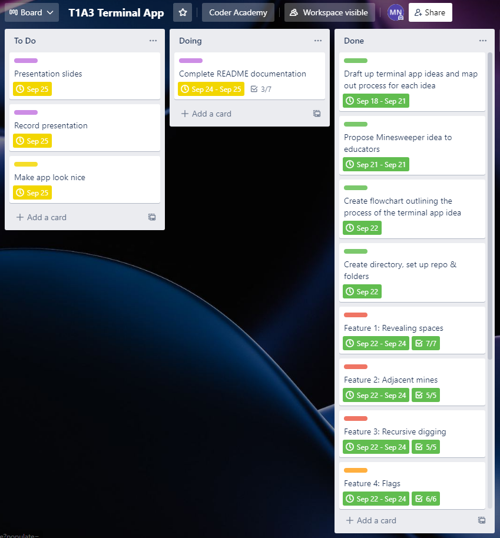
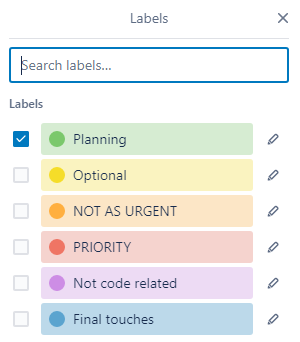
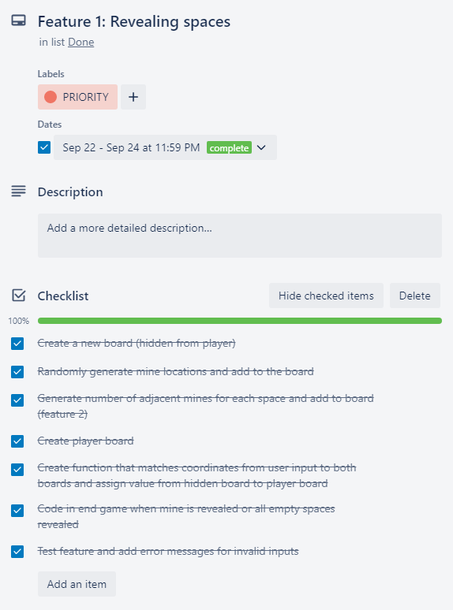
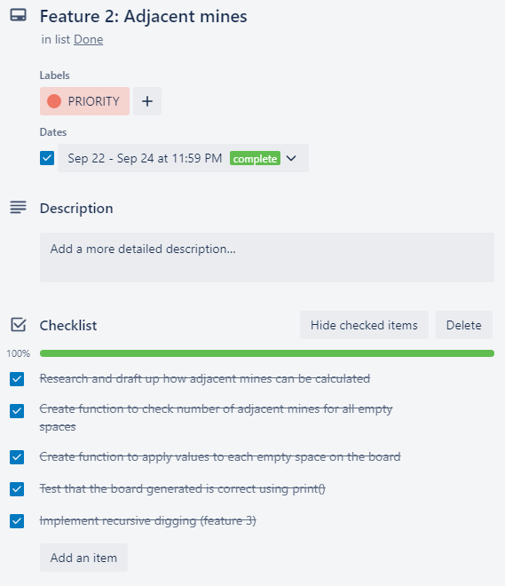
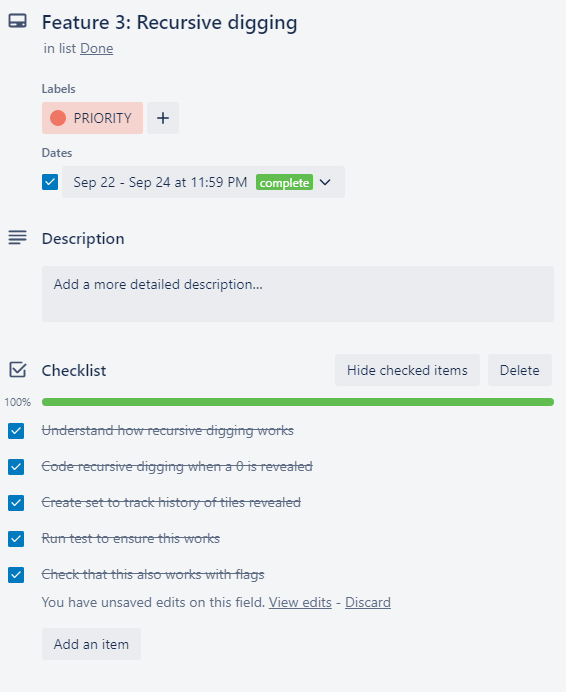
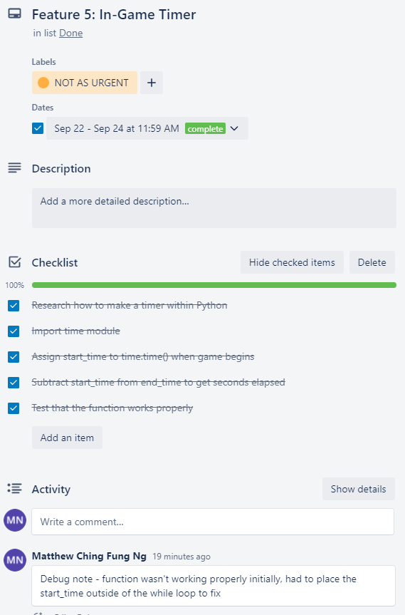
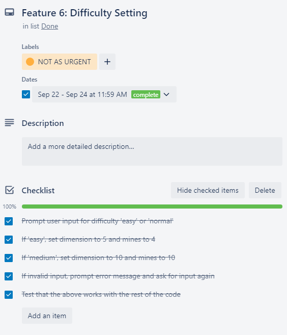

# Matthew Ng - T1A3 Terminal Application

## Link to Source Control Repository (R4)

### [Github Repo](https://github.com/matthewngc/MatthewNg_T1A3)

### [Presentation Video]()

### [Presentation Slides]()

## Overview of Terminal Application

The purpose of this terminal application is to recreate the popular game of Minesweeper that can be played within the terminal. The goal of Minesweeper is to reveal all the empty tiles on a grid, without revealing any mines that are hidden throughout the grid. The game ends when all the empty tiles are cleared on the grid, or when a mine is revealed.

This terminal application will aim to reproduce these key game mechanics, as well as implement features such as the ability to place flags, a functional timer, and multiple difficulty options.

## Features (R6)

### *Feature 1: Revealing Spaces*

The premise of a Minesweeper game is to reveal all the empty spaces on the grid without hitting a single mine. As such, the feature that forms the basis of the game is the functionality to reveal a specific space based on a user input.

In order to implement this feature, there are two boards that is generated when the game starts. The first board is hidden from the player, and shows all the locations of the mines and empty spaces. The second board is the one that the player will be playing on, and will constantly update after every user input. Both boards are represented by a list of lists, and the dimensions correspond such that the coordinates of each space match between the two boards.

The core of this function is per below:

```python
def show_space(player_board, dimensions, newboard, row, col, input_history):
    input_history.add((row,col))
    if player_board[row][col] == newboard[row][col]:
        print("You have already revealed this spot! Please enter a different coordinate.")
        press_to_continue()
        return True
    if newboard[row][col] == '@':
        return False
    if newboard[row][col] > 0:
        player_board[row][col] = newboard[row][col]
        return True
    if newboard[row][col] == 0:
        player_board[row][col] = newboard[row][col]
        return True
```

Essentially, the above function matches the coordinates entered by the player with the respective value on the hidden board. If this value is not a mine, the respective position on the player board is replaced with this value, and the game will continue. However, if the value is a mine (represented by '@'), the loop within the play function will break, and the game will end.

### *Feature 2: Adjacent Mines*

At the core of a game of Minesweeper, the most essential feature is the display of adjacent mines for any given empty space. By showing these adjacent mines as hints, a player is able to complete a game of Minesweeper without landing on any mines.

To understand how this feature is to be implemented, it is important to understand the logic behind how these checks are performed.

For any given space ( 0 , 0 ) on a Minesweeper board, the surrounding spaces are defined as follows:

```python
       (-1,-1 ) (-1,0 ) (-1,1 )
       ( 0,-1 ) ( 0,0 ) ( 0,1 )
       ( 1,-1 ) ( 1,0 ) ( 1,1 )
```

where ( 0 , 0 ) is the space that the player has selected.

In order to find the mines adjacent to this uncovered space, a check is performed on the four cardinal directions (North, East, South, West), as well as the four diagonals, to see whether these spaces contain a mine.

A count is performed for each adjacent space where a mine is located, and the total of this count is assigned to the space that the player has revealed, for a value of 0 to 8.

To replicate this check in the terminal application, the following function is used:

```python
    def check_mines(dimensions, board, row, col):
        adjacent_mines = 0
        for x in range(max(0,row-1), min(dimensions-1, row +1)+1):
            for y in range (max(0,col-1), min(dimensions-1,col+1)+1):
                if x == row and y == col:
                    continue
                if board[x][y] == '@':
                    adjacent_mines += 1
        return adjacent_mines
```

Per the above function, the initial value of adjacent mines is set to zero. The proceeding 'for' loops check the eight adjacent spaces around any given space for mines. A max and min function has been included in the range to ensure that the checks stay within the bounds of the board, specifically pertaining to the spaces on the edge of the board. The count of adjacent mines is then indexed by 1 for each mine that is present in the adjacent cells. Finally, the value is returned.

The returned value is then assigned to the corresponding space on the board using the following function:

```python
def show_adjacent_mines(dimensions, board):
    for x in range(dimensions):
        for y in range(dimensions):
            if board[x][y] == '@':
                continue
            board[x][y] = check_mines(dimensions, board, x, y)
```

The 'for' loops in the above function will ensure that each empty space on the board is assigned a value representing the number of mines adjacent to this space.

### *Feature 3: Recursive Digging*

One of the quality-of-life features of the original Minesweeper game is the ability to recursively dig through empty tiles until an empty tile that is adjacent to mines is revealed. Upon understanding the logic behind Feature 1, it is relatively straightforward to achieve this recursive algorithm within the show_space function using the following code:

```python
    if newboard[row][col] == 0:
        player_board[row][col] = newboard[row][col]
        for r in range(max(0,row-1), min(dimensions-1,row+1)+1):
            for c in range(max(0,col-1),min(dimensions-1,col+1)+1):
                if (r,c) in input_history:
                    continue
                if player_board[r][c] == 'F':
                    continue
                clickspace(player_board, dimensions, newboard, r, c, input_history)
    if newboard[row][col] > 0:
        player_board[row][col] = newboard[row][col]
        return True    
```

In essence, the above code snippet states that if a space is revealed and the value is zero, then the show_space function will be repeatedly performed on the adjacent tiles in each direction until a tile with adjacent mines, that is, any empty tiles with a value greater than zero, is reached, or a flag is reached, at which point the loop ends and the player is prompted to select another tile.

### *Feature 4: Flags*

Another user-friendly feature of the original Minesweeper game is the flagging function, which allows the player to place a flag on the spaces where they believe a mine is located. This flagging feature is not only useful as a visual aid to assist the player in completing the game, but also prevents the player from accidentally selecting a tile that they know is a mine.

When played within the terminal where the player is prone to misinputs, this feature is especially practical from a quality-of-life point of view. The code of the flag feature is built into the place_flag function as below:

```python
def place_flag(player_board, row, col):
    if player_board[row][col] != ' ' and player_board[row][col] != 'F':
        print("You can't put a flag here!")
    elif player_board[row][col] == 'F':
        player_board[row][col] = ' '
    else:
        player_board[row][col] = 'F'
```

Per the above function, the player can place a flag on a space by including an 'F' after the coordinate of the space. They can also remove a flag by repeating this step. Considerations have also been included in the show_space function to prevent a flagged tile from being revealed:

```python
    if player_board[row][col] == 'F':
        print("There is a flag here! Type 'F' after the coordinate to remove the flag (row,col,F).")
        press_to_continue()
        return True
```

### *Feature 5: In-Game Timer*

An in-game timer has also been implemented in this terminal application to allow players to see how long it took for them to complete the game. The timer is achieved by importing the time() method from the time module and using the following code within the play function:

```python
    start_time = time.time()

    if emptyspace:
        os.system("clear")
        print("Congrats, you won!")
        display(newboard)
        print(f"Your time was {int(time.time()-start_time)} seconds!")
        replay()
```

The time() method returns the time in seconds since the epoch (January 1, 1970, 00:00:00 (UTC)). By assigning a variable to time.time() when the Minesweeper game is initiated and taking the difference between this variable and the time.time() at which the game is completed, a timer function can be replicated.

### *Feature 6: Difficulty Setting*

The final feature of this terminal application is a difficulty setting, which is common in many variations of Minesweeper. This difficulty setting is based on an input from the user confirming which difficulty they would like to play on. The difficulty selected will define the paramaters at which the board is generated, varying in the dimensions of the board and the number of mines placed on the board. For now, there are only two difficulty levels available to be played on this version of the terminal application.

The code for this feature is as follows:

```python
    while True:
        difficulty = input("Please enter the difficulty you want to play on./n"
        'Easy mode: 5x5, 4 mines \n'
        'Normal mode: 10 x 10, 10 mines \n').lower()
        if difficulty == "easy":
            dimensions = 5
            max_mines = 4
            break
        elif difficulty == "normal":
            dimensions = 10
            max_mines = 10
            break
        else:
            os.system('clear')
            print("Invalid difficulty - please enter 'easy' or 'normal'")
            press_to_continue()
            continue
```

Per above, the parameters of dimensions and max_mines varies depending on the difficulty that the user selects. These parameters are subsequently passed into several functions in order to generate the board and continue through the game.

## Implementation Plan (R7)

For the implementation plan of this project, the online project management tool Trello was used to draft up an outline of the plan for the overall project, as well as checklists for each individual feature. Labels were used to identify which features are the most important to complete first in order to have the game working, and which features can be implemented later or are optional. Due dates are also set for each task in the project in order to gauge the overall progress and time management.

See below for screenshots of the Trello board for this project, as well as the labels and checklists for each of the features:
















## Installation Instructions (R8)

## Style Guide (R5)

https://peps.python.org/pep-0008/

## Referenced Sources (R3)
